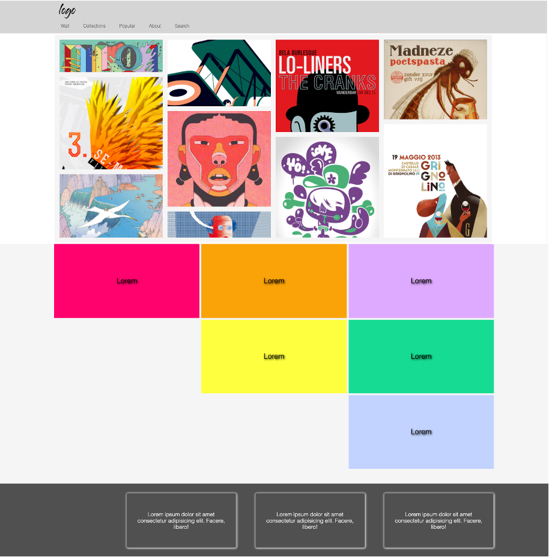
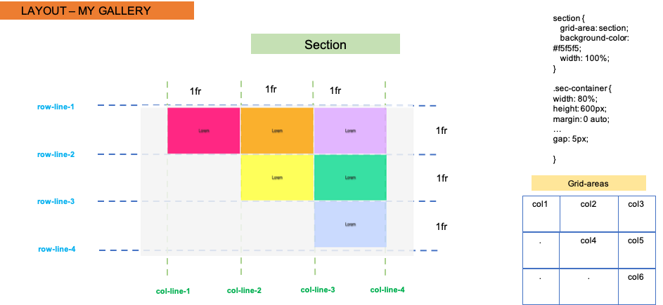

# Grid layout example - 1

Grid layout example, which is not responsive.

## Layout designs

* The whole document

* Main section

* Second part

* Footer part

## The onlive version

In order to see live version, just [click...!](https://hsnakk.github.io/grid_layout-1/)